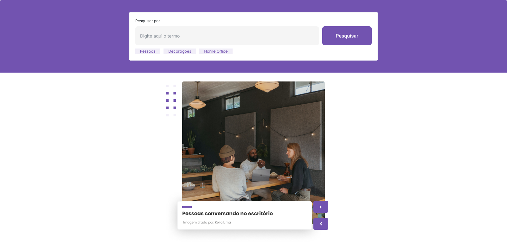

# Entrega - Fotos Daqui

Para esta avaliação, você irá criar uma aplicação web para exibir fotos que foram tiradas próximas da localização geográfica do usuário.

## Introdução

Para iniciar, clone esse repositório.

Você pode utilizar o seguinte layout como base para a estilização do seu app. [Clique aqui](https://www.figma.com/file/FFpGusmhfOaXfYB2Zt0lvw/M2---Sprint1---Slider-Images?node-id=12%3A248) para acessar o figma!

Veja um preview abaixo:



Seu app irá usar a API de geolocalização para determinar a localização do usuário(latitude e longitude), e em seguida irá usar a API do Flickr para obter uma lista de fotos que foram tiradas perto deste local.

Exiba a primeira foto na página, junto com um link para a página dela no Flickr. Forneça algum modo de avançar as fotos.

## Tarefas

Para fazer a construção do seu app fotos daqui, você precisará seguir os seguintes passos:

1. Obter a localização geográfica a partir do seu navegador
2. Obter a sua chave de API na plataforma do Flickr
3. Construir a URL de consulta
4. Usar o fetch para enviar a solicitação ao Flickr;
5. Construir a URL de fonte de imagens;
6. Exibir a primeira imagem na página;
7. Exibir a próxima imagem.

## Passo a Passo

### Passo 1 - Obter a localização geográfica a partir do seu navegador

Se a API de geolocalização estiver indisponível ou se o usuário se recusar a fornecer sua localização, use uma latitude e longitude hard-code de sua escolha(escolha um local bacana!)

[https://developer.mozilla.org/pt-BR/docs/Web/API/Geolocation_API](https://developer.mozilla.org/pt-BR/docs/Web/API/Geolocation_API)
[https://developer.mozilla.org/pt-BR/docs/Web/API/Geolocation](https://developer.mozilla.org/pt-BR/docs/Web/API/Geolocation)

### Passo 2 - Obter a sua chave de API na plataforma do Flickr

Para obter a sua API key, você vai precisar acessar esse [link](https://www.flickr.com/services/api/misc.api_keys.html). Nessa página você vai encontrar mais detalhes sobre como obter a chave, leia com atenção para saber mais.

Em seguida, você vai acessar o link "Apply for your key online now", e será redirecionado para a página de criação de conta do Flickr, onde você precisará criar uma conta(ou apenas logar mesmo, caso ja tenha uma conta).

A próxima página, será a "The App Garden", onde você irá escolher entre duas opções. Você irá selecionar a opção "APPLY FOR A NON-COMMERCIAL KEY", já que o objetivo da construção desse projeto é apenas didático.

Para finalizar, você vai precisar dar um nome, de sua escolha, para a aplicação, e resumir brevemente com as suas palavras qual o aplicativo que irá construir. E em seguida, você será direcionado para a página com a key.

### Passo 3 - Construir a URL de consulta

Exemplo de URL de consulta(que não deve conter espaços nem quebras de linha):

```
https://flickr.com/services/rest/?api_key=993fake589fake6cdfakefcb&format=json&nojsoncallback=1&method=flickr.photos.search&safe_search=1&per_page=5&lat=-25.4284&lon=-49.2733&text=cachorros
```
Para construirmos a URL de consulta, utilizaremos uma URL base, e também passando mais alguns valores como parâmetro. São eles:

- api_key
- safe_search
- per_page
- lat e lon
- text

#### api_key

Uma API key, para que você possa ter acesso à API do Flickr, essa é a chave que você precisou criar no passo anterior.

#### safe_search

Utilizaremos esse parâmetro para evitar imagens potencialmente sensíveis(Você irá mostrar seu site para sua avó, certo?). Vamos definí-lo como 1.

#### per_page

Esse parâmetro define a quantidade de imagens por consulta. Para evitar sobrecargas no servidor, vamos definí-lo com o valor de 5.

#### lat e lon

A latitude e longitude, obtidas anteriormente, já que a consulta é feita baseada em uma localização.

#### text

Um valor text, que será a palavra chave de busca. O exemplo acima buscará por fotos de "cachorros".

> **Aviso!**
> 
> **CORS Proxy**
> 
> A API do Flickr é um pouco antiga, então ela lida com [solicitações cross-origin](https://developer.mozilla.org/pt-BR/docs/Web/HTTP/Controle_Acesso_CORS) de uma forma antiquada que a API fetch não suporta. Portanto, para poder usar o fetch com a API do Flickr, você precisará rotear suas solicitações através de um servidor proxy que irá adicionar os cabeçalhos apropriados para satisfazer o sistema de segurança do navegador conhecido como CORS (Cross-Origin Resource Sharing, ou Compartilhamento de Recursos de Origem Cruzada). Em outras palavras, em vez de enviar suas solicitações diretamente para o Flickr, seu programa irá enviá-las para outro servidor que irá atuar como "tradutor" entre as solicitações fetch do seu programa e a antiga API do Flickr.
> 
> Para passar suas solicitações pelo proxy, adicione o domínio https://shrouded-mountain-15003.herokuapp.com/, ao início da URL da API do Flickr. Exemplo:
> 
> https://shrouded-mountain-15003.herokuapp.com/https://flickr.com/services/rest/?api_key=993c9d05898cfd6cd16b4fcb18401be0&format=json&nojsoncallback=1&method=flickr.photos.search&safe_search=1&per_page=5&lat=-25.4284&lon=-49.2733&text=cachorros
> (Este proxy de nome esquisito é uma instância personalizada do Randy para o [proxy CORS-Anywhere](https://github.com/Rob--W/cors-anywhere).)

### Passo 4 - Usar o fetch para enviar a solicitação ao Flickr

Agora que você já tem a URL para a consulta, utilize o fetch, para enviar a solicitação ao Flickr. Se necessário, volte no conteúdo e consulte a aula "Aula: Introdução ao Fetch".

Se quiser saber mais sobre a documentação da API de busca do Flickr, você pode acessar esse [link aqui](https://www.flickr.com/services/api/flickr.photos.search.html)!(em inglês).

### Passo 5 - Construir a URL de fonte de imagens

O objeto de resposta contém um array que contém propriedades para um número de fotos, mas na verdade não contém as URLs das fotos. Em vez disso, cada objeto de foto do array contém alguns valores que podem ser montados para formar uma URL. Consulte a [documentação da API do Flickr "Photo Source URLs"](https://www.flickr.com/services/api/misc.urls.html) para mais detalhes.

Exemplo de objeto de resposta:

```javascript
{
    "photos": {
        "page": 1,
        "pages": 208,
        "perpage": 2,
        "total": "624",
        "photo": [
            {
                "id": "32549725528",
                "owner": "36432048@N08",
                "secret": "ed3d4317ea",
                "server": "4829",
                "farm": 5,
                "title": "",
                "ispublic": 1,
                "isfriend": 0,
                "isfamily": 0
            }, {
                "id": "32549725168",
                "owner": "36432048@N08",
                "secret": "065f06a238",
                "server": "4916",
                "farm": 5,
                "title": "",
                "ispublic": 1,
                "isfriend": 0,
                "isfamily": 0
            }
        ]
    },
    "stat": "ok"
}
```

O seu código que constrói a URL da fonte de imagens da primeira imagem no array poderá ser algo assim:

```javascript
function constructImageURL (photoObj) {
    return "https://farm" + photoObj.farm +
            ".staticflickr.com/" + photoObj.server +
            "/" + photoObj.id + "_" + photoObj.secret + ".jpg";
}
const imageUrl = constructImageURL(response.photos.photo[0]);
```

### Passo 6 - Exibir a primeira imagem

Adicione um elemento de imagem à página usando a URL acima como src attribute. O navegador então fará o fetch e exibirá a foto.

### Passo 7 - Exibir a próxima imagem

Forneça um modo para que o usuário veja a próxima foto. Você pode usar um botão escrito "Próxima", um setTimeout que avança para a próxima foto depois de um certo tempo, ou algum outro método da sua escolha. Certifique-se de exibir instruções para o usuário na página.

Depois que a última foto do array for exibida, avançar mais uma vez deve exibir a primeira foto.

## Entrega

Faça o push do código para o seu repositório GitHub e implemente-o via GitHub pages. No Canvas, por favor, envie a url do seu GitHub pages(por exemplo https://nomedeusuario.gitlab.io/photos-from-here/) e, nos comentários, a url do seu Repo GitHub.